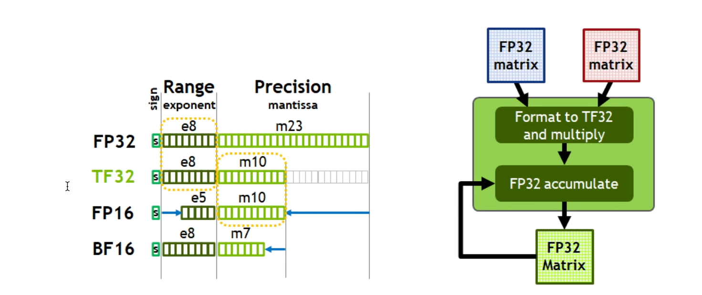

# Notes for Let's reproduce GPT-2

## 权重复用

* 在输入的token_embedding和输出的linear层，其大小是相同的，都是[Vocab_size,embed_size]
只是前者是一个查找表，后者是一个全连接。但是在embed空间内希望语义相近的两个词在一起的话，都是类似的。
* 所以在反传的时候梯度也是累加的。而且参数共享压缩了模型

## 训练加速

* torch 默认的所有参数以及激活值都是fp32，太大了
* most of the bottleneck in the training is the limitation of GPU bandwidth.The tensor core is always waiting fot data
* 
* 混合精度：权重是fp32，而激活值和loss是bf16